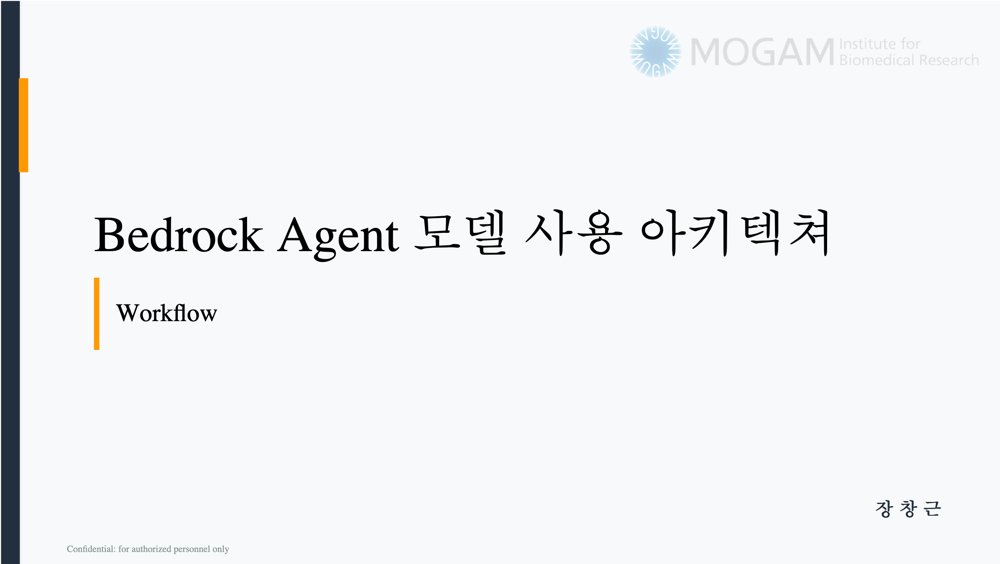

# Bedrock AI LLM Pipeline

AWS Bedrock 모델 사용을 중앙 정책으로 통제하는 `Bedrock Gateway`와 운영 포털을 함께 구성한 저장소입니다.  
사용자별 월간 KRW 한도, 승인 워크플로, 실시간 사용량 추적, 장시간 추론 분리 처리, 운영 감사 로그를 하나의 흐름으로 관리합니다.

## Architecture Overview

이 저장소의 아키텍처는 `260310_Bedrock Gateway 기반 모델 사용 아키텍처` 발표 자료를 바탕으로 정리되었으며, 현재 구현/배포 구조 기준으로 다음 흐름을 따릅니다.

1. 사용자는 `IAM Identity Center` 기반으로 인증합니다.
2. 모델 호출은 `API Gateway`와 `Lambda Gateway`를 통해서만 진입합니다.
3. `DynamoDB`에서 사용자 정책, 가격, 한도, 요청 ledger를 조회/기록합니다.
4. 짧은 요청은 Lambda에서 직접 Bedrock을 호출합니다.
5. 장시간 요청은 `Step Functions + ECS Fargate`로 우회해 처리합니다.
6. 승인, 알림, 감사 추적까지 운영 포털과 함께 연결됩니다.

## Key Components

- `account-portal/`
  - 운영자가 사용자/팀/승인/사용량을 관리하는 포털
- `docs/bedrock-gateway-README.md`
  - Bedrock Gateway 아키텍처와 실제 배포 구성을 정리한 상세 문서
- `infra/`
  - 인프라 정의 및 배포 관련 코드

## Detailed Docs

- [Bedrock Gateway Architecture](./docs/bedrock-gateway-README.md)
- [Long-running Bedrock Architecture](./docs/ai/long-running-bedrock-architecture-final.md)
- [Gateway Final Validation Report](./docs/ai/gateway-final-validation-report.md)
- [Gateway v2 Spec](./docs/ai/gateway-v2-spec.md)

## Operational Focus

- 사용자별 KRW 월간 한도 관리
- 승인 기반 예외 처리
- `request_ledger`, `monthly_usage` 중심의 사용량 추적
- 장시간 추론 분리 실행
- 운영 포털 기반 가시성 확보

