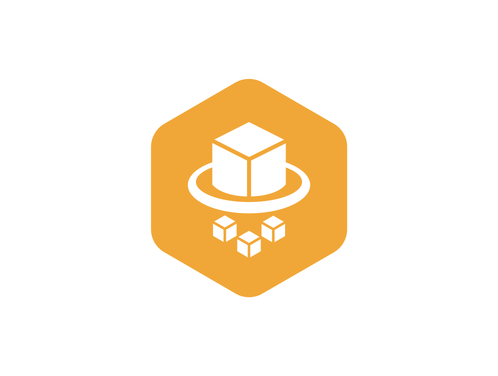

# Bedrock Access Control Gateway

AWS Bedrock 모델 호출을 중앙 관리하는 게이트웨이. 사용자별 KRW 비용 기반 월간 한도, 승인 워크플로, 실시간 사용량 추적, 비동기 장시간 호출(Fargate), 포털 관리 기능 제공.

## 아키텍처

### 아키텍처 다이어그램


이 문서는 `260310_Bedrock Gateway 기반 모델 사용 아키텍처` 발표 자료의 아키텍처 정의, 요청 순서, 전체 흐름 슬라이드를 기준으로 현재 저장소 구현과 실제 배포 구성을 정리한 문서다.

### 주요 서비스 관점

<p align="center">
  
</p>

- 인증과 사용자 식별은 `IAM Identity Center`와 Assume Role 흐름을 그대로 유지한다.
- 모델 호출 제어는 `API Gateway + Lambda Gateway`에서 정책/한도 검증 후 집행한다.
- 장시간 요청은 `Step Functions + ECS Fargate`로 우회해 사용자 경험을 단일 엔드포인트로 유지한다.
- 사용량, 가격, 승인, 감사 로그는 `DynamoDB` 계층에서 일관되게 관리한다.

### 설계 의도

- 사용자는 기존 `IAM Identity Center SSO`와 CLI/SDK 프로필을 그대로 사용한다.
- 모델 호출은 반드시 중앙 `Gateway`를 경유한다.
- 한도 이내 사용은 별도 승인 없이 바로 허용한다.
- 예외 승인만 포털에서 처리하고, 알림은 `SES`가 담당한다.
- 실시간 Quota 차감과 사용량 추적은 `Lambda + DynamoDB`가 담당한다.
- 장시간 호출은 사용자에게 별도 엔드포인트를 요구하지 않고 내부에서 `Step Functions + Fargate`로 우회한다.

### v1: Sync Inline (≤29초)

```
사용자 (BedrockUser-{username} assume role)
  → API Gateway REST Regional (SigV4 AWS_IAM auth)
    → Lambda (handler.py, 900s timeout)
      → Bedrock Converse API (inline)
      → DynamoDB (사용량/비용/정책/승인)
```

짧은 모델 호출(Claude Haiku 등)은 Lambda 내에서 직접 Bedrock Converse API를 호출하고 응답을 동기 반환.

### v2: Async Fargate (>29초, long-running)

```
사용자 → API Gateway → Lambda (/converse)
  ├─ 짧은 호출: inline Bedrock (v1 경로)
  └─ 긴 호출: hidden async 라우팅
       → S3 payload 저장
       → DynamoDB job_state 생성 + budget reservation
       → Step Functions 시작
           → Fargate Task (worker container)
               → Bedrock InvokeModel
               → DynamoDB settlement (actual usage)
               → S3 result 저장
       → 클라이언트에 job_id 반환
       → GET /converse/jobs/{job_id} 로 폴링
```

Opus 등 장시간 모델은 서버 측에서 자동으로 async/Fargate 경로로 라우팅. 사용자는 기존 `/converse` 엔드포인트만 호출하면 됨.

### 아키텍처 순서

1. 사용자는 `IAM Identity Center`를 통해 인증한다.
2. `~/.aws/config`의 Permission Set 기반 프로필로 임시 자격증명을 획득한다.
3. 클라이언트는 `API Gateway REST API`에 SigV4 서명 요청을 보낸다.
4. `Lambda`가 호출자 Identity Center 사용자를 식별한다.
5. `DynamoDB`에서 사용자별 한도, 모델 권한, 남은 예산을 조회하고 차감한다.
6. 정책을 통과한 요청만 `Bedrock Runtime`으로 전달된다.
7. 응답은 스트리밍 또는 단건 응답으로 반환된다.
8. 호출 결과와 사용량은 `CloudWatch`, `request_ledger`, `monthly_usage` 등에 기록된다.

### 전체 흐름 요약

```text
End Users
  -> IAM Identity Center / Assume Role
  -> API Gateway REST API
  -> Lambda AI Gateway
  -> DynamoDB Quota / Policy / Ledger
  -> Bedrock Runtime / Agent Model

Portal / Approval API
  -> 관리자 승인 처리
  -> SES 이메일 알림

Long-running requests
  -> S3 payload
  -> Step Functions
  -> ECS Fargate worker
  -> DynamoDB settlement / S3 result
```

### 운영 관점 핵심 포인트

- `Gateway`는 정책 집행과 사용량 제어를 담당한다.
- `Portal`은 승인 처리와 운영 관리 UI를 담당한다.
- `SES`는 승인 메일과 운영 알림 채널로만 사용한다.
- `Step Functions + Fargate`는 29초를 넘는 장시간 추론을 분리 처리한다.
- `DynamoDB`는 Quota, pricing, approval, per-request audit의 단일 운영 저장소 역할을 한다.

## 실제 배포된 AWS 리소스 (dev 환경, us-west-2)

| 리소스 | ID/ARN |
|--------|--------|
| API Gateway REST (Regional) | `<GATEWAY_API_ID>` |
| Lambda | `bedrock-gw-dev-gateway` (Python 3.12, 256MB, 900s timeout) |
| ECS Cluster (Fargate) | `bedrock-gw-dev-cluster` |
| Task Definition | `bedrock-gw-dev-worker` (256 CPU, 512 MB) |
| ECR Repository | `<ACCOUNT_ID>.dkr.ecr.us-west-2.amazonaws.com/bedrock-gw-dev-worker` |
| Step Functions | `bedrock-gw-dev-job-orchestrator` (Standard) |
| S3 Bucket | `bedrock-gw-dev-payload-<ACCOUNT_ID>` |
| VPC | `vpc-0b52ff4687fde0661` |
| Private Subnets | `<SUBNET>`, `<SUBNET>` |
| Security Group | `<SG>` |

## DynamoDB 테이블 (15개)

네이밍: `bedrock-gw-{env}-{region}-{table}`

| 테이블 | PK | SK | 용도 |
|--------|----|----|------|
| `principal-policy` | `principal_id` | — | 사용자별 정책 (한도, 허용 모델, 이메일) |
| `monthly-usage` | `principal_id_month` | `model_id` | 월간 KRW 비용 + 토큰 사용량 (TTL 35일) |
| `model-pricing` | `model_id` | — | 모델별 KRW 가격 (관리자 관리) |
| `request-ledger` | `request_id` | — | 요청별 감사 로그 (불변, PutItem only) |
| `daily-usage` | `principal_id_date` | `model_id` | 일별 사용량 (레거시, TTL) |
| `temporary-quota-boost` | `principal_id` | `boost_id` | 승인된 한도 증액 (TTL) |
| `approval-request` | `request_id` | — | 승인 요청 (GSI: principal-status-index) |
| `approval-pending-lock` | `principal_id` | — | 중복 승인 요청 방지 lock (TTL) |
| `session-metadata` | `request_id` | — | 세션 보안 정보 (TTL) |
| `idempotency-record` | `request_id` | — | 중복 요청 방지 (TTL) |
| `team-config` | `team_id` | — | 팀 구성 (관리자, 사용자, 이메일) |
| `governance-audit` | `audit_id` | — | 관리 작업 감사 로그 (TTL) |
| `longrun-request` | `request_id` | — | 장시간 요청 추적 (authorize → settle) |
| `job-state` | `job_id` | — | v2 async job 상태 (GSI: principal-created-index) |
| `concurrency-semaphore` | `slot_id` | — | v2 Fargate 동시 실행 제한 (TTL) |

## Step Functions State Machine 구조

`bedrock-gw-dev-job-orchestrator` (Standard, timeout 3600s)

```
UpdateJobQueued (DynamoDB: job_state → QUEUED)
  → RunFargateTask (ecs:runTask.sync)
      → 성공: UpdateJobSucceeded (job_state → SUCCEEDED)
      → 실패: UpdateJobFailed (job_state → FAILED, error_message 기록)
```

- `RunFargateTask`는 `.sync` 통합으로 Fargate 완료까지 대기
- 실패 시 `States.ALL` catch → `UpdateJobFailed`로 분기

## Fargate Task Definition 상세

- Family: `bedrock-gw-dev-worker`
- Compatibility: FARGATE
- Network Mode: awsvpc
- CPU: 256 (0.25 vCPU), Memory: 512 MB
- Execution Role: `bedrock-gw-dev-fargate-exec` (ECR pull + CloudWatch Logs)
- Task Role: `bedrock-gw-dev-fargate-task` (Bedrock InvokeModel + DynamoDB + S3)
- Container Image: `<ACCOUNT_ID>.dkr.ecr.us-west-2.amazonaws.com/bedrock-gw-dev-worker:latest`
- Log Group: `/aws/ecs/bedrock-gw-dev-worker` (retention 90일)

### Worker 컨테이너 환경변수

| 변수 | 소스 |
|------|------|
| `AWS_DEFAULT_REGION` | var.aws_region |
| `TABLE_JOB_STATE` | DynamoDB job-state 테이블명 |
| `TABLE_MONTHLY_USAGE` | DynamoDB monthly-usage 테이블명 |
| `TABLE_MODEL_PRICING` | DynamoDB model-pricing 테이블명 |
| `TABLE_REQUEST_LEDGER` | DynamoDB request-ledger 테이블명 |
| `PAYLOAD_BUCKET` | S3 payload 버킷명 |

Step Functions에서 override로 주입되는 변수:

| 변수 | 설명 |
|------|------|
| `JOB_ID` | 비동기 job UUID |
| `REQUEST_ID` | 원본 요청 ID |
| `PRINCIPAL_ID` | 호출자 principal |
| `MODEL_ID` | Bedrock 모델 ID |
| `REGION` | AWS 리전 |
| `PRICING_VERSION` | 가격 버전 |
| `PAYLOAD_REF` | S3 payload 경로 |

## IAM Role 구조

### 1. Lambda Execution Role (`bedrock-gw-dev-lambda-exec`)
- `AWSLambdaBasicExecutionRole` (CloudWatch Logs)
- Bedrock: `InvokeModel`, `InvokeModelWithResponseStream`
- DynamoDB: 전체 테이블 read/write (RequestLedger는 PutItem only, UpdateItem/DeleteItem Deny)
- ModelPricing: read-only (GetItem, Query, Scan)
- TeamConfig: read-only (Scan, GetItem)
- SES: `SendEmail`, `SendRawEmail`
- Step Functions: `StartExecution` (job-orchestrator)
- S3: `PutObject`, `GetObject` (payload bucket)

### 2. Fargate Execution Role (`bedrock-gw-dev-fargate-exec`)
- `AmazonECSTaskExecutionRolePolicy` (ECR pull + CloudWatch Logs)

### 3. Fargate Task Role (`bedrock-gw-dev-fargate-task`)
- Bedrock: `InvokeModel`
- DynamoDB: job-state, monthly-usage (read/write), request-ledger (PutItem only), model-pricing (read-only)
- S3: `GetObject`, `PutObject` (payload bucket)

### 4. Step Functions Execution Role (`bedrock-gw-dev-sfn-exec`)
- ECS: `RunTask`, `StopTask`, `DescribeTasks` (gateway cluster only)
- IAM: `PassRole` (fargate-exec, fargate-task)
- DynamoDB: job-state, concurrency-semaphore (read/write)
- CloudWatch Logs: log delivery 관리
- EventBridge: rule 관리

## 한도 모델

| 항목 | 값 |
|------|-----|
| 기본 한도 | KRW 500,000/월 |
| 최대 한도 | KRW 2,000,000/월 |
| 승인 증액 | KRW 500,000 고정 |
| 글로벌 월 예산 | KRW 10,000,000 |
| 월 경계 | KST (UTC+9) |
| 환율 | 1 USD = 1,450 KRW (고정) |
| 집행 방식 | DynamoDB 실시간 (Cost Explorer 아님) |

## Lambda 환경변수 전체 목록

| 변수 | 설명 |
|------|------|
| `ENVIRONMENT` | 배포 환경 (dev/staging/prod) |
| `TABLE_PRINCIPAL_POLICY` | 사용자 정책 테이블 |
| `TABLE_DAILY_USAGE` | 일별 사용량 테이블 |
| `TABLE_MONTHLY_USAGE` | 월별 사용량 테이블 |
| `TABLE_MODEL_PRICING` | 모델 가격 테이블 |
| `TABLE_TEMPORARY_QUOTA_BOOST` | 한도 증액 테이블 |
| `TABLE_APPROVAL_REQUEST` | 승인 요청 테이블 |
| `TABLE_REQUEST_LEDGER` | 감사 로그 테이블 |
| `TABLE_SESSION_METADATA` | 세션 메타데이터 테이블 |
| `TABLE_IDEMPOTENCY_RECORD` | 멱등성 레코드 테이블 |
| `TABLE_APPROVAL_PENDING_LOCK` | 승인 lock 테이블 |
| `TABLE_LONGRUN_REQUEST` | 장시간 요청 테이블 |
| `TABLE_JOB_STATE` | v2 async job 상태 테이블 |
| `TABLE_CONCURRENCY_SEMAPHORE` | v2 동시 실행 제한 테이블 |
| `PAYLOAD_BUCKET` | v2 payload/result S3 버킷 |
| `SFN_STATE_MACHINE_ARN` | v2 Step Functions ARN |
| `SES_SENDER_EMAIL` | 발신 이메일 |
| `SES_ADMIN_GROUP_EMAIL` | 기본 관리자 이메일 (팀 관리자 우선) |
| `DISCOVERY_MODE` | principal normalization 캡처 모드 |

## Lambda API 엔드포인트

| Method | Path | 설명 |
|--------|------|------|
| POST | `/converse` | Bedrock 모델 호출 (자동 sync/async 라우팅) |
| GET | `/converse/jobs/{job_id}` | v2 async job 상태 조회 |
| POST | `/converse/jobs/{job_id}/cancel` | v2 async job 취소 |
| POST | `/approval/request` | 한도 증액 승인 요청 |
| GET | `/quota/status` | 현재 한도/사용량 조회 |
| POST | `/longrun/authorize` | 장시간 직접 호출 인가 |
| POST | `/longrun/settle` | 장시간 호출 정산 |
| POST | `/discovery` | principal normalization 캡처 (discovery mode) |

## 구성 요소

### 1. Terraform IaC (`infra/bedrock-gateway/`)

| 파일 | 내용 |
|------|------|
| `main.tf` | API Gateway REST API (Regional, AWS_IAM auth) |
| `lambda.tf` | Lambda 함수 + alias |
| `iam.tf` | Lambda execution role + 정책 |
| `dynamodb.tf` | DynamoDB 15개 테이블 |
| `ecs.tf` | v2 ECS Cluster + Fargate task definition |
| `stepfunctions.tf` | v2 Step Functions state machine |
| `s3.tf` | v2 payload/result S3 bucket |
| `variables.tf` | 입력 변수 |
| `outputs.tf` | 출력 값 |
| `logs.tf` | CloudWatch log groups |
| `locals.tf` | prefix, table_prefix |
| `providers.tf` | AWS provider + required versions |
| `backend.tf` | S3 backend (주석 처리, 설정 필요) |
| `env/dev.tfvars` | dev 환경 변수 |

### 2. Lambda 코드 (`infra/bedrock-gateway/lambda/`)
- `handler.py` — 게이트웨이 메인 핸들러 (~2200 lines)

### 3. Fargate Worker (`infra/bedrock-gateway/worker/`)
- `main.py` — 실제 Bedrock 호출 worker
- `main_synthetic.py` — 테스트용 synthetic worker (sleep + mock)
- `Dockerfile` — Python 3.12-slim + boto3

### 4. Backend Admin Routes (`account-portal/backend-admin/routes/`)
- `gateway_usage.py` — 사용량/정책/가격 조회 API
- `gateway_teams.py` — 팀/사용자/관리자 관리 + IAM role 자동 프로비저닝
- `gateway_approval.py` — 승인 요청/처리/이메일 발송
- `gateway_pricing.py`, `gateway_policy.py`, `gateway_ledger.py` — 보조 API

### 5. 클라이언트 (`account-portal/backend-admin/data/`)
- `bedrock_gw.py` — Python 클라이언트 (boto3 호환 wrapper)
- `bedrock-gw-quota-check.sh` — Shell hook (승인 프롬프트)
- `bedrock-gw-request.sh`, `bedrock-gw-status.sh` — CLI 도구

### 6. Frontend (`account-portal/frontend/src/pages/`)
- `BedrockGateway.jsx` — 게이트웨이 관리 포털 페이지

## 배포

```bash
# Terraform (Lambda + API Gateway + DynamoDB + ECS + SFN + S3)
cd infra/bedrock-gateway
terraform workspace select dev
terraform plan -var-file=env/dev.tfvars
terraform apply -var-file=env/dev.tfvars

# Fargate Worker Docker Image
cd infra/bedrock-gateway/worker
aws ecr get-login-password --region us-west-2 | docker login --username AWS --password-stdin <ACCOUNT_ID>.dkr.ecr.us-west-2.amazonaws.com
docker build -t bedrock-gw-dev-worker .
docker tag bedrock-gw-dev-worker:latest <ACCOUNT_ID>.dkr.ecr.us-west-2.amazonaws.com/bedrock-gw-dev-worker:latest
docker push <ACCOUNT_ID>.dkr.ecr.us-west-2.amazonaws.com/bedrock-gw-dev-worker:latest

# Backend Admin (포털 API)
cd account-portal
docker compose -f docker-compose-fixed.yml up -d --build backend-admin

# Frontend
docker run --rm -v $(pwd)/account-portal/frontend:/app -w /app node:22-slim sh -c "npm run build"
```

## 검증 결과 요약

- 2,400건 연속 비용 정확도 테스트: 0.000000% 오차
- 25개 모델 병렬 호출: 전 건 정확
- v2 async: 5-parallel × 30분 synthetic 테스트 PASS
- Cancel path (state + reservation + ledger): PASS
- Orphan cleanup: PASS
- Semaphore saturation: PASS
- Hidden async routing (/converse → internal async): PASS
